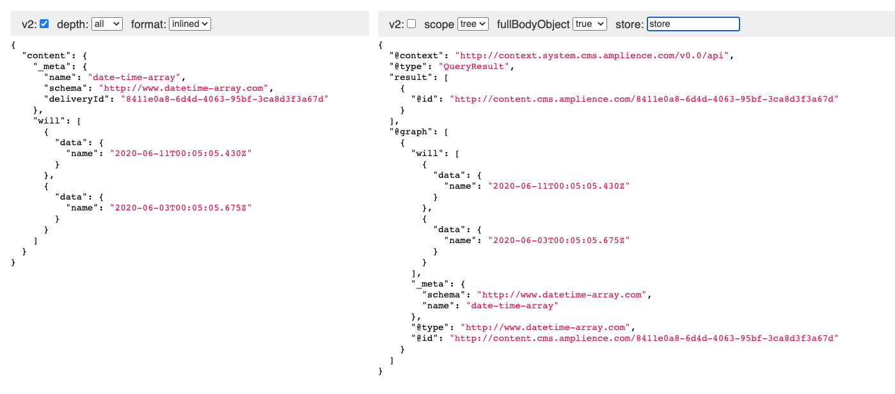

# Content Delivery Visualization 

Used to generate a preview of your delivery data.



## URL params

### Required
* `vse` - Staging enviroment to serve content from.
* `id` - id of content item to load.

### Optional
* `depth` - Either `root` or `all`. In cdv1 mode these map to `root` and `tree` respectively for the param `scope`.
* `format` - Either `linked` or `inline`. In cdv1 mode these map to `false` and `true` respectively for the param `fullBodyObject`.
* `v2` - set to `false` to enable cdv1 mode.
* `store` - sets the `store` value used in cdv1 mode. Defaults to `store`.

## Get started

Install the dependencies...

```bash
npm install
```

```bash
npm run dev
```

Navigate to [localhost:5000](http://localhost:5000). You should see your app running. 

## Building and running in production mode

To create an optimised version of the app:

```bash
npm run build
```

You can run the newly built app with `npm run start`. This uses [sirv](https://github.com/lukeed/sirv), which is included in your package.json's `dependencies` so that the app will work when you deploy to platforms like [Heroku](https://heroku.com).

## Deploying to the web

### With [now](https://zeit.co/now)

Install `now` if you haven't already:

```bash
npm install -g now
```

Then, from within your project folder:

```bash
cd public
now deploy --name my-project
```

As an alternative, use the [Now desktop client](https://zeit.co/download) and simply drag the unzipped project folder to the taskbar icon.

### With [surge](https://surge.sh/)

Install `surge` if you haven't already:

```bash
npm install -g surge
```

Then, from within your project folder:

```bash
npm run build
surge public my-project.surge.sh
```
